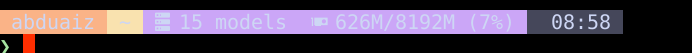

# starship-ai-prompt

A [Starship](https://starship.rs/) prompt with two extra segments for local-AI workstations:

- **Ollama** — shows the number of available models (or `running/total loaded` when a model is hot), only while the `ollama` systemd service is active.
- **GPU VRAM** — shows `used/total (percent)` from `nvidia-smi`.

Both segments are **cached** (GPU: 5 s, Ollama: 30 s) so they never block the prompt, and both **self-hide** when their backend isn't present.



Theme: Catppuccin Mocha powerline.

## Requirements

| Tool | Required? | Used by |
|------|-----------|---------|
| [starship](https://starship.rs/) | yes | the prompt itself |
| A [Nerd Font](https://www.nerdfonts.com/) | yes | all glyphs (`   󰒋 󰢮 …`) |
| `curl` | yes | Ollama segment |
| `systemd` (`systemctl`) | for Ollama segment | gating the Ollama segment |
| `nvidia-smi` | for GPU segment | GPU VRAM segment |

Non-NVIDIA or non-systemd machines work fine — the relevant segment just stays hidden.

## Install

```bash
git clone https://github.com/azoz8/starship-ai-prompt.git
cd starship-ai-prompt
./install.sh
```

The installer:

- checks dependencies and warns about optional ones,
- copies the two helper scripts to `~/.local/bin` (`chmod 755`, no `sudo`),
- installs `starship.toml` to `$STARSHIP_CONFIG` (or `~/.config/starship.toml`), **backing up any existing config first**,
- reminds you to add `eval "$(starship init <shell>)"` if it's missing.

Non-interactive: `./install.sh --yes`.

Then open a new terminal.

## Sharing without GitHub access

This repo may be private. To hand it to a friend without adding them as a
collaborator, send them a tarball:

```bash
git archive --format=tar.gz -o ~/starship-ai-prompt.tar.gz HEAD
```

They extract it and run `./install.sh` — no GitHub account needed.

## Uninstall

```bash
./uninstall.sh
```

Removes the helper scripts and caches. `starship.toml` is left in place; restore
a `starship.toml.bak.*` backup to get your previous prompt back.

## Layout

```
.
├── starship.toml          # prompt definition (declarative)
├── bin/
│   ├── starship-ollama    # Ollama model-count segment (cached)
│   └── starship-gpu       # GPU VRAM segment (cached)
├── install.sh
└── uninstall.sh
```

## License

MIT — see [LICENSE](LICENSE).
